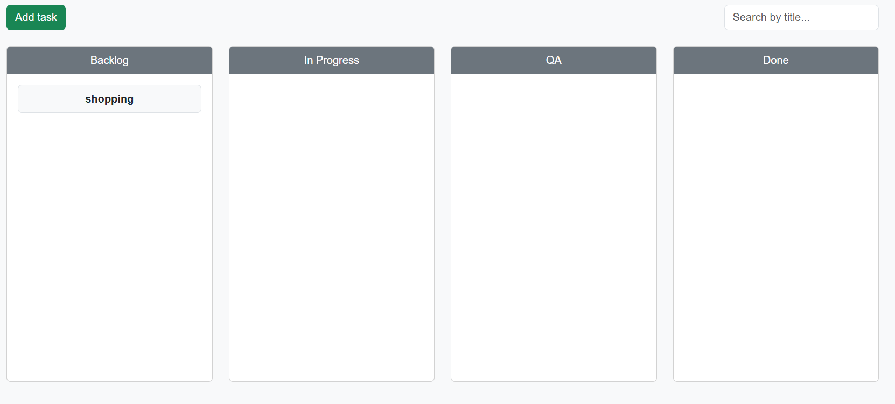
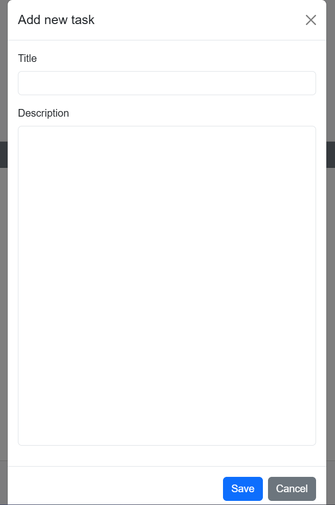
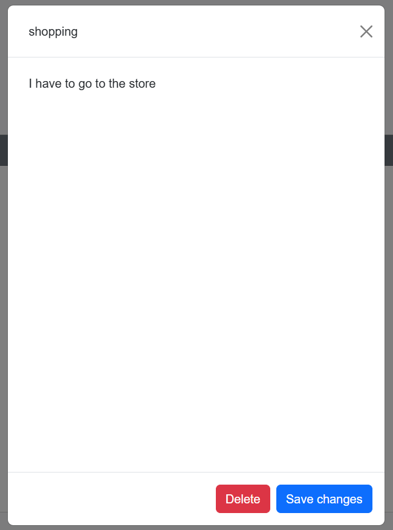
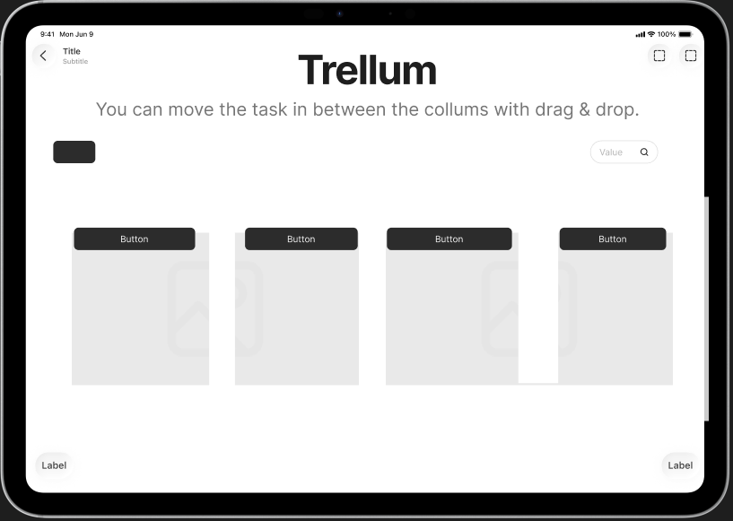
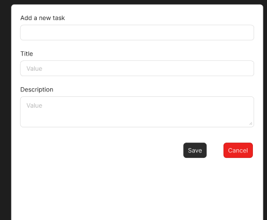
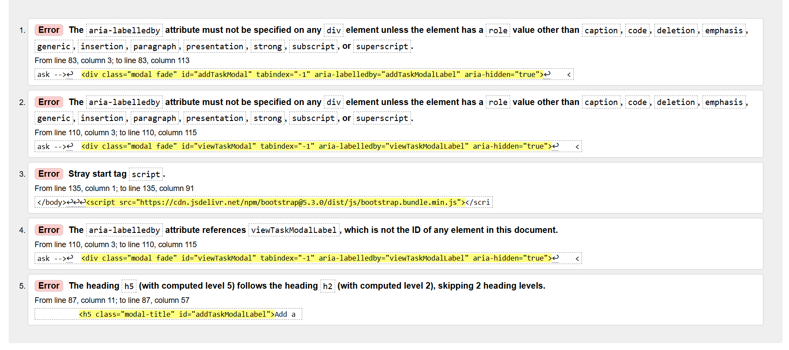
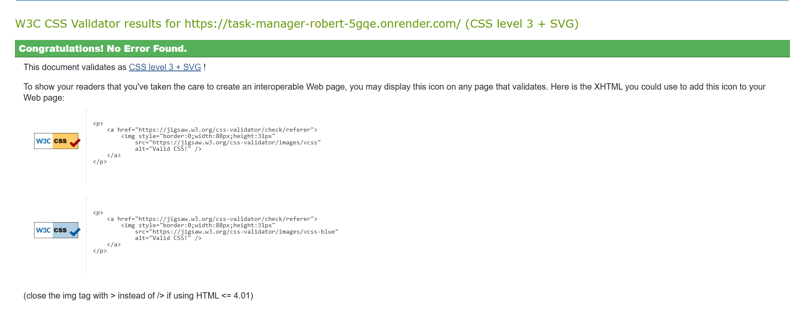

# 📝 Flask Task Manager

A simple Task Manager built with Flask. You can create, edit, delete, and move tasks between different statuses (`To Do`, `In Progress`, `Done`) using **drag and drop**.

## 🎯 Project Purpose

The goal of this project is to provide a simple yet powerful interface for managing tasks. Inspired by Kanban boards, it allows users to easily organize, track, and prioritize tasks within a clean, drag-and-drop interface.

---

## 🔧 Installation

## 🚀 Deployment

This project — **task_manager_robert** — is hosted on **Render** and the source code is available on GitHub.

🔗 **Live Deployment:** [https://task-manager-robert-5gqe.onrender.com/](https://task-manager-robert-5gqe.onrender.com/)  
💻 **GitHub Repository:** [https://github.com/RobMaty/task_manager_robert](https://github.com/RobMaty/task_manager_robert)

---

### 🧩 Local Deployment

To run this project locally on your own machine:

1. **Clone the repository**
   ```bash
   git clone https://github.com/yourusername/task_manager_robert.git
   cd task_manager_robert


### 2. Create and Activate a Virtual Environment

```bash
python -m venv venv
venv\Scripts\activate
```

### 3. Install Dependencies

```bash
pip install -r requirements.txt
```


## 🚀 Running the Application

Start the app locally with:

```bash
python app.py
```

Then open your browser and go to
https://task-manager-robert-5gqe.onrender.com/
## 🧑‍💻 User Experience (UX)

### 🖌️ Design
The design of Trellum emphasizes clarity, ease of use, and a clean workflow. It mimics the intuitive feel of Kanban boards while keeping the interface lightweight and distraction-free.

### 🎨 Layout and UI
Four-Column Grid: Tasks are displayed in four clear status columns — Backlog, In Progress, QA, and Done — aligned horizontally, making it easy to track progress at a glance.

Centered Header: A minimalist page title sits centered at the top for visual balance and branding.

Search and Add Functionality:

A green “Add Task” button stands out in the upper-left corner.

A search bar in the upper-right allows real-time filtering by task title.

Rounded Cards: Each task appears as a card with soft edges and subtle shadows for modern aesthetics.

### 🎨 Color Scheme
Neutral Background: Light grey (#f8f9fa) provides a soft, non-distracting workspace.

Dark Grey Column Headers: Improve legibility and visual hierarchy.

Green Accent (Add Task Button): Draws attention for task creation.

Soft Card Backgrounds: Tasks have white or lightly shaded cards to focus attention on the content.

### 💻 Responsiveness
The layout is designed with Bootstrap and custom CSS to ensure compatibility across modern desktop browsers and scalable for tablets.

Columns stack on smaller screens (if responsive behavior is extended in CSS).

### 🧑‍🎨 Typography
Sans-serif fonts provide a modern, professional feel.

Task titles are bold and centered for quick scanning.

Placeholder and input text are legible and well-spaced.

### First-Time Users:
- Understand the purpose of the app instantly
- Create their first task with minimal guidance
- Drag tasks across columns intuitively

### Returning Users:
- View saved tasks and current progress
- Continue updating or managing tasks seamlessly

### Frequent Users:
- Manage multiple tasks efficiently
- Benefit from persistent data storage
- Get a fast, lightweight alternative to more complex tools

## ✅ Features

### 🔨 Full CRUD Functionality for Tasks:
- Create new tasks
- Edit existing tasks
- Delete tasks

### 🟢 Drag and Drop Support Between Columns:
- Backlog
- In Progress
- QA
- Done

## 🖼️ Screenshots for the app functionality 

### Task Log


### Add task


### Edit task


## Design

### Wireframes

All wireframes were created using Figma. Here are the models for the Main page and Add task.






## DevTools

### Lighthouse results

!(light1.png)
!(light2.png)
!(light3.png)
!(light4.png)

### Validator Testing
- **HTML** - Validated with W3C Markup Validator.


- **CSS** - Checked using W3C CSS Validator.


### 💾 Local Storage Options (In-memory or SQLite database support)
### 🔁 Tasks retain their status after page refresh


## 📦 Examples of Libraries Used
- Flask – Core framework
- Flask-SQLAlchemy – ORM for SQLite support
- gunicorn – (Optional) For production deployment
- SortableJS – Drag-and-drop functionality in the frontend
- Bootstrap - for style

## 🤝 Credits
Developed by Robert-Cristian Matyas

Inspired by popular task board applications like Trello

Thanks to the Code Institute and community Slack channels for guidance and feedback